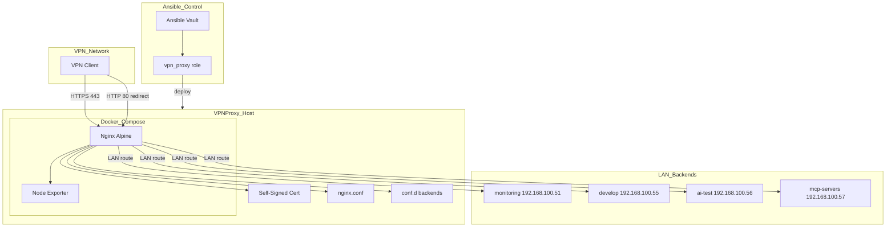
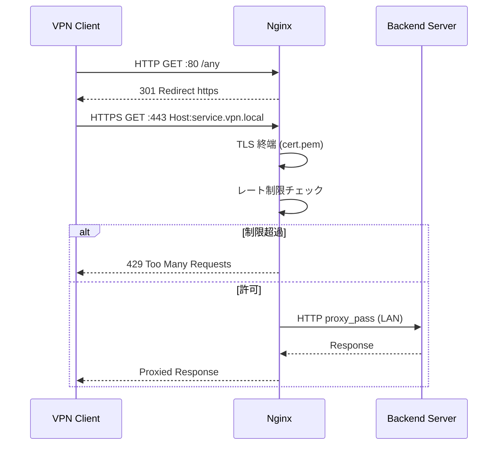
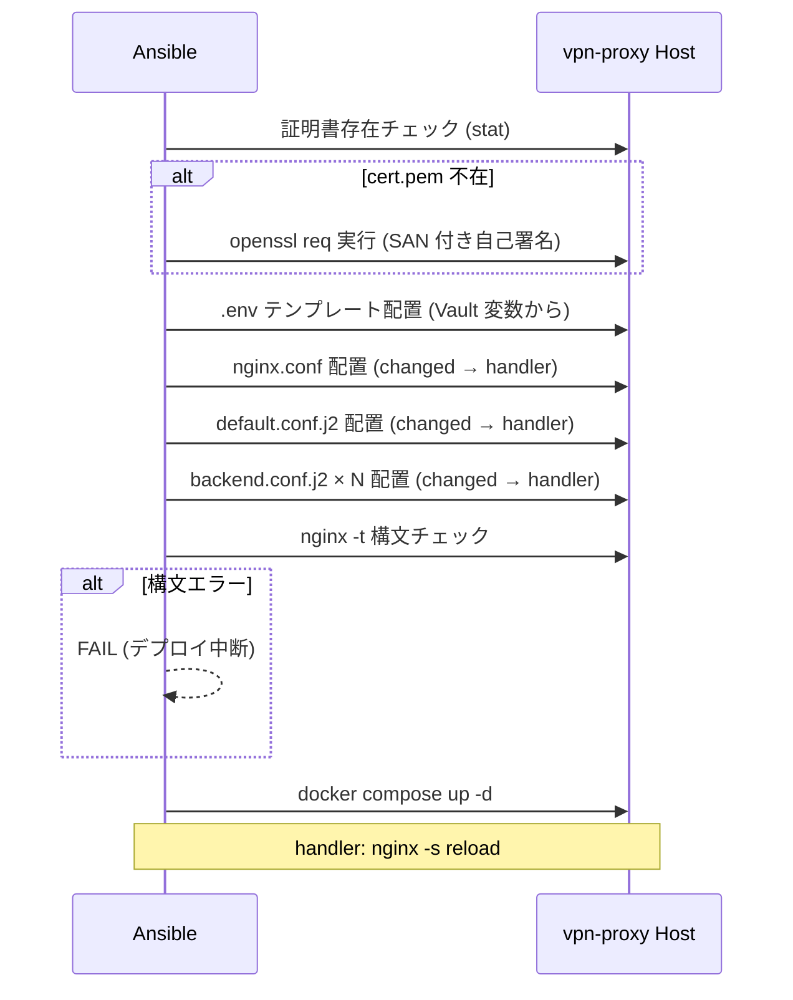

# 設計ドキュメント: vpn-reverse-proxy

## 概要

vpn-proxy サービスは、WireGuard VPN 接続済みサーバー（`vpn-proxy.abe365.org`）上で稼働する nginx ベースのリバースプロキシである。VPN クライアントが VPN 経由でアクセスした際、VPN 非接続の拠点内 LAN サーバー群（`192.168.100.0/24` サブネット）へ透過的にルーティングする。

本設計は `service/vpn-proxy/` 配下の Docker Compose 構成を Ansible ロール化し、Nginx 設定の完全化（SSL/TLS 終端・WebSocket・ログ管理・ヘルスチェック）と Ansible による冪等デプロイを実現することを対象とする。なお `service/vpn-proxy/` には nginx.conf・docker-compose.yml の基礎実装が既に存在しており、本仕様はその拡張および Ansible 自動化に相当する。

### Goals
- ホスト名ベースの仮想ホストルーティングにより、VPN クライアントが複数バックエンドへ透過的にアクセスできる
- VPN 内部通信を自己署名証明書で HTTPS 化し、TLSv1.2/1.3 のみを許可する
- WebSocket を使用するバックエンド（Grafana Live・Dify・Jupyter 等）の接続を維持する
- レート制限・セキュリティヘッダーにより不正アクセスと過負荷を防止する
- `/health`・`/metrics` エンドポイントで Prometheus/Grafana 監視に統合する
- Ansible ロールで冪等デプロイを実現し、手動作業を排除する

### Non-Goals
- 各バックエンドサービス（monitoring・develop 等）の内部設定変更
- WireGuard VPN サーバー自体の設定
- Cloudflare DNS レコード管理（内部専用 `.vpn.local` ドメインのため）
- Let's Encrypt を使用した公的 CA 証明書の取得（NAT 越し環境の制約により不可）
- TCP/UDP ストリームプロキシ（SSH・データベース転送等）
- Basic Auth 等の追加認証レイヤー

---

## Boundary Commitments

### This Spec Owns
- `service/vpn-proxy/` 配下の全 nginx 設定ファイル（`nginx.conf`・`conf.d/*.conf`）
- `service/vpn-proxy/docker-compose.yml` の最終形（SSL ポート 443 対応）
- `service/vpn-proxy/.env.example` のスキーマ定義
- 自己署名証明書の生成手順（`nginx/ssl/cert.pem` / `key.pem`）
- `ansible/inner_roles/vpn_proxy/` ロールの全タスク・テンプレート・ハンドラー
- `ansible/vpn_proxy.yml` プレイブック

### Out of Boundary
- バックエンドサービス（monitoring・develop 等）側の nginx 設定
- WireGuard VPN 接続設定（`ansible/wireguard*.yml` 管理下）
- Prometheus・Grafana 側のスクレイプ設定（monitoring スペックの管轄）
- `vpn-proxy.abe365.org` のホスト初期化（`ansible/linux.yml` 管轄）

### Allowed Dependencies
- ホスト上の Docker / Docker Compose（`ansible/inner_roles/docker` 管轄）
- WireGuard VPN が正常稼働し、vpn-proxy ホストが `192.168.100.0/24` に到達可能であること
- Ansible Vault（`~/.ssh/.ansible_vault_pass`）によるシークレット管理基盤

### Revalidation Triggers
- バックエンドサーバーの IP アドレス・ポートの変更
- VPN サブネット（デフォルト `10.0.0.0/24`）の変更
- nginx:alpine のメジャーバージョン変更
- Ansible Vault 変数スキーマの変更

---

## Architecture

### Existing Architecture Analysis

`service/vpn-proxy/` には以下の基礎実装が存在する：

- `docker-compose.yml`: nginx + node-exporter の 2 サービス構成、HTTP(80)/HTTPS(443) ポートマッピング定義済み
- `nginx/nginx.conf`: レート制限ゾーン・セキュリティヘッダー・proxy_log フォーマット定義済み
- `nginx/conf.d/default.conf`: `/health`・`/metrics` エンドポイント（HTTP のみ）
- `nginx/conf.d/proxy-backends.conf.example`: バックエンドルーティング例（HTTPS・WebSocket 対応）

**不足している要素**：
- 実際の `proxy-backends.conf`（テンプレートのみ）
- SSL 証明書ファイル（`nginx/ssl/cert.pem` / `key.pem`）
- HTTPS 対応の `default.conf`（443 リッスン）
- Ansible ロール全体

### Architecture Pattern & Boundary Map



**Architecture Integration**:
- 選択パターン: Virtual Host + Upstream ブロック構成（既存パターンの踏襲）
- ドメイン境界: nginx レイヤーが唯一の外部接点、バックエンドは LAN 経由のみ
- 既存パターン保持: `inner_roles/docker` 依存、`group_vars/all/` 変数集約
- 新規コンポーネント: `inner_roles/vpn_proxy` ロール（既存の `inner_roles/common`・`inner_roles/docker` と同レベル）
- Steering 準拠: Docker Compose 内完結、Vault 暗号化、冪等性必須

### Technology Stack

| レイヤー | 選択 / バージョン | 本機能での役割 | 備考 |
|---------|----------------|--------------|------|
| リバースプロキシ | nginx:alpine（stable） | SSL 終端・仮想ホスト・WebSocket・レート制限 | 既存の docker-compose.yml 定義済み |
| 監視エクスポーター | prom/node-exporter:latest | `/metrics` 公開・Prometheus スクレイプ対応 | 既存の docker-compose.yml 定義済み |
| コンテナ管理 | Docker Compose v2 | サービス起動・停止・ネットワーク管理 | `docker compose` プラグイン形式 |
| 構成管理 | Ansible（Docker コンテナ実行） | ロールベース冪等デプロイ | `inner_roles/vpn_proxy` 新規追加 |
| シークレット管理 | Ansible Vault | `.env` 生成・証明書パスフレーズ | `~/.ssh/.ansible_vault_pass` |
| SSL/TLS | OpenSSL（自己署名） | EC-P384 鍵・SAN 付き証明書 | Let's Encrypt 不可（NAT 制約） |

---

## File Structure Plan

### Directory Structure

```
service/vpn-proxy/
├── docker-compose.yml            # 既存（HTTPS 443 ポート定義済み）
├── .env.example                  # 既存（スキーマ定義）
├── .gitignore                    # 既存（.env・ssl/ 除外）
├── nginx/
│   ├── nginx.conf                # 既存（レート制限・ログフォーマット定義済み）
│   ├── ssl/                      # 証明書ディレクトリ（git 除外）
│   │   ├── cert.pem              # Ansible 自動生成（非追跡）
│   │   └── key.pem               # Ansible 自動生成（非追跡）
│   └── conf.d/
│       ├── default.conf          # 変更: HTTP→HTTPS リダイレクト・443 ヘルスチェック追加
│       ├── proxy-backends.conf.example  # 既存（参照用テンプレート）
│       └── [service].conf        # Ansible テンプレートで生成（バックエンドごと）
└── logs/nginx/                   # ボリュームマウント先（git 除外）

ansible/
├── vpn_proxy.yml                 # 新規: vpn_proxy ロールのプレイブック
└── inner_roles/
    └── vpn_proxy/                # 新規ロール
        ├── defaults/
        │   └── main.yml          # ロールデフォルト変数（バックエンド定義・レート制限値）
        ├── tasks/
        │   └── main.yml          # タスクリスト（証明書生成・設定配置・Compose 起動）
        ├── templates/
        │   ├── env.j2            # .env ファイル生成テンプレート
        │   ├── backend.conf.j2   # バックエンド仮想ホスト設定テンプレート
        │   └── default.conf.j2   # default.conf（health/metrics）テンプレート
        └── handlers/
            └── main.yml          # nginx reload ハンドラー
```

### Modified Files
- `service/vpn-proxy/nginx/conf.d/default.conf` — HTTP→HTTPS リダイレクト、443 SSL リッスン、`/health`・`/metrics` の HTTPS 対応を追加

---

## System Flows

### リクエストルーティングフロー



### Ansible デプロイフロー



---

## Requirements Traceability

| 要件 | サマリー | コンポーネント | インターフェース | フロー |
|------|---------|-------------|----------------|--------|
| 1.1 | server_name ベース仮想ホストルーティング | NginxVirtualHost | upstream ブロック + proxy_pass | リクエストルーティング |
| 1.2 | 未定義ホスト名への 404 返却 | NginxVirtualHost | default_server catch-all | — |
| 1.3 | upstream ブロックによる拡張可能構造 | NginxVirtualHost | upstream ブロック定義 | — |
| 1.4 | conf.d/ include ディレクティブ | NginxConfig | nginx.conf include | — |
| 1.5 | プロキシヘッダー付与 | NginxVirtualHost | proxy_set_header | リクエストルーティング |
| 2.1 | WebSocket ヘッダー設定 | NginxVirtualHost | proxy_http_version / Upgrade | — |
| 2.2 | WebSocket 接続維持 | NginxVirtualHost | keepalive / timeout | — |
| 2.3 | WebSocket ハンドシェイク失敗時のエラー返却 | NginxVirtualHost | エラーレスポンス | — |
| 3.1 | HTTP→HTTPS 301 リダイレクト | NginxSSL | listen 80 return 301 | リクエストルーティング |
| 3.2 | TLSv1.2/1.3 のみ許可 | NginxSSL | ssl_protocols | — |
| 3.3 | 自己署名証明書での SSL 終端 | NginxSSL | ssl_certificate / ssl_certificate_key | — |
| 3.4 | 証明書不在時の起動拒否 | NginxSSL | nginx 起動前チェック | Ansible デプロイ |
| 3.5 | SAN 付き自己署名証明書生成手順 | AnsibleRole | openssl req タスク | Ansible デプロイ |
| 4.1 | 10 req/s レート制限 | NginxSecurity | limit_req zone=general | — |
| 4.2 | 同時接続 10 接続制限 | NginxSecurity | limit_conn | — |
| 4.3 | 制限超過時 HTTP 429 返却 | NginxSecurity | limit_req_status 429 | — |
| 4.4 | 許可サブネット外アクセス拒否 | NginxSecurity | allow/deny ディレクティブ | — |
| 4.5 | セキュリティレスポンスヘッダー付与 | NginxSecurity | add_header | — |
| 5.1 | /health エンドポイント | NginxHealth | return 200 "healthy" | — |
| 5.2 | /metrics エンドポイント（Node Exporter プロキシ） | NginxHealth | proxy_pass node-exporter:9100 | — |
| 5.3 | /metrics Prometheus 形式レスポンス | NodeExporter | node-exporter コンテナ | — |
| 5.4 | Node Exporter 到達不能時 502 返却 | NginxHealth | upstream エラー処理 | — |
| 5.5 | ヘルスチェックのアクセスログ除外 | NginxHealth | access_log off | — |
| 6.1 | サービスごとのアクセスログファイル | NginxLogging | access_log per-vhost | — |
| 6.2 | エラーログ warn レベル記録 | NginxLogging | error_log warn | — |
| 6.3 | logs/nginx/ ボリュームマウント | DockerCompose | volumes 定義 | — |
| 6.4 | プロキシ情報含むカスタムログフォーマット | NginxLogging | log_format proxy_log | — |
| 7.1 | Docker Compose 起動・停止・再起動管理 | AnsibleRole | docker compose up/down | Ansible デプロイ |
| 7.2 | 証明書自動生成 | AnsibleRole | openssl タスク | Ansible デプロイ |
| 7.3 | 設定変更検知・nginx reload | AnsibleRole | notify handler | Ansible デプロイ |
| 7.4 | チェックモードでの差分のみ報告 | AnsibleRole | Ansible --check 対応 | — |
| 7.5 | Vault 変数から .env 生成 | AnsibleRole | template タスク | Ansible デプロイ |
| 7.6 | nginx -t 失敗時のデプロイ中断 | AnsibleRole | command nginx -t + failed_when | Ansible デプロイ |

---

## Components and Interfaces

### コンポーネント一覧

| コンポーネント | ドメイン / レイヤー | Intent | 要件カバレッジ | 主要依存 (P0/P1) | Contracts |
|-------------|-----------------|--------|-------------|-----------------|-----------|
| NginxConfig | インフラ / プロキシ基盤 | nginx.conf グローバル設定（レート制限ゾーン・ログフォーマット・include） | 1.4, 4.1, 4.2, 4.5, 6.4 | — | State |
| NginxVirtualHost | インフラ / ルーティング | バックエンドごとの仮想ホスト定義（upstream・proxy_pass・WebSocket） | 1.1, 1.2, 1.3, 1.5, 2.1, 2.2, 2.3 | NginxSSL (P0), NginxConfig (P0) | API |
| NginxSSL | インフラ / セキュリティ | SSL 終端・HTTP→HTTPS リダイレクト・証明書管理 | 3.1, 3.2, 3.3, 3.4, 3.5 | 証明書ファイル (P0) | State |
| NginxSecurity | インフラ / セキュリティ | レート制限・接続制限・サブネット制御・セキュリティヘッダー | 4.1, 4.2, 4.3, 4.4, 4.5 | NginxConfig (P0) | State |
| NginxHealth | インフラ / 監視 | /health・/metrics エンドポイント、ヘルスチェックログ除外 | 5.1, 5.2, 5.4, 5.5 | NodeExporter (P1) | API |
| NginxLogging | インフラ / オブザーバビリティ | サービスごとのアクセス/エラーログ、カスタムフォーマット | 6.1, 6.2, 6.3, 6.4 | NginxConfig (P0) | State |
| NodeExporter | インフラ / 監視 | システムメトリクス収集・Prometheus スクレイプ対応 | 5.2, 5.3, 5.4 | Docker ネットワーク (P0) | API |
| DockerCompose | インフラ / コンテナ管理 | nginx + node-exporter サービス起動・ネットワーク・ボリューム | 6.3, 7.1 | Docker Engine (P0) | State |
| AnsibleRole | 自動化 / デプロイ | vpn_proxy ロール全体（証明書生成・設定配置・Compose 管理・Vault 統合） | 7.1, 7.2, 7.3, 7.4, 7.5, 7.6 | inner_roles/docker (P0), Ansible Vault (P0) | Service |

---

### インフラ / プロキシ基盤

#### NginxConfig

| フィールド | 詳細 |
|----------|------|
| Intent | nginx.conf グローバル設定の定義と管理 |
| 要件 | 1.4, 4.1, 4.2, 4.5, 6.4 |

**Responsibilities & Constraints**
- `limit_req_zone` / `limit_conn_zone` の定義（`general: 10r/s`・`strict: 3r/s`・`conn_limit`）
- `log_format proxy_log`（`$upstream_addr`・`$upstream_response_time`・`$upstream_status` 含む）
- `include /etc/nginx/conf.d/*.conf` による分割設定読み込み
- グローバルセキュリティヘッダー（`X-Frame-Options`・`X-Content-Type-Options`・`X-XSS-Protection`）
- `server_tokens off` による nginx バージョン隠蔽
- この設定ファイルはコンテナ内の `/etc/nginx/nginx.conf` にマウントされる

**Dependencies**
- Inbound: AnsibleRole — ファイル配置・変更検知 (P0)
- External: Docker Compose volumes — コンテナへのマウント (P0)

**Contracts**: State [x]

**Implementation Notes**
- Integration: 既存 `nginx.conf` を Ansible テンプレート管理に移行する。変数化する項目は `worker_connections`・レート制限値のみ
- Validation: `nginx -t` による構文チェックを Ansible デプロイ時に必須実行
- Risks: グローバルヘッダーはすべての仮想ホストに影響するため、バックエンド側で上書きが必要な場合はサービス個別の `conf.d/*.conf` で `add_header` を再定義する

---

#### NginxVirtualHost

| フィールド | 詳細 |
|----------|------|
| Intent | バックエンドごとの仮想ホスト定義（ルーティング・WebSocket） |
| 要件 | 1.1, 1.2, 1.3, 1.5, 2.1, 2.2, 2.3 |

**Responsibilities & Constraints**
- `upstream <service>_backend` ブロック定義（拡張可能な構造）
- HTTP (80) → HTTPS (443) リダイレクト用 server ブロック（`return 301`）
- HTTPS (443) server ブロック：`server_name <service>.vpn.local`
- `proxy_pass http://<service>_backend`
- プロキシヘッダー: `Host`・`X-Real-IP`・`X-Forwarded-For`・`X-Forwarded-Proto`
- WebSocket ヘッダー: `proxy_http_version 1.1`・`Upgrade $http_upgrade`・`Connection "upgrade"`
- サービスごとのアクセスログ / エラーログ設定
- 未定義ホスト名は `default.conf` の catch-all server（HTTP 404）が受け取る

**Dependencies**
- Inbound: AnsibleRole — `backend.conf.j2` テンプレートから生成 (P0)
- Outbound: Backend Servers（LAN `192.168.100.x`） — HTTP proxy_pass (P0)
- External: NginxSSL — SSL 証明書参照 (P0)

**Contracts**: API [x]

##### API Contract

| 受信 | エンドポイント | 受信条件 | 転送先 | エラー |
|------|------------|--------|-------|-------|
| GET/POST/WS | `https://<service>.vpn.local/*` | TLS 接続・rate limit 通過 | `http://<backend_ip>:<port>/*` | 429, 502, 504 |
| GET | `http://<service>.vpn.local/*` | — | HTTPS 301 リダイレクト | — |

**Implementation Notes**
- Integration: Ansible テンプレート `backend.conf.j2` でバックエンドリストをループ生成。`vpn_proxy_backends` 変数（`defaults/main.yml`）で定義
- Validation: 各バックエンドエントリは `name`・`server_name`・`upstream_host`・`upstream_port` を必須フィールドとする
- Risks: WebSocket 接続は `proxy_read_timeout` 設定に依存する。AI 系バックエンドは処理時間が長いため `300s` を基準とする

---

#### NginxSSL

| フィールド | 詳細 |
|----------|------|
| Intent | VPN 内部 HTTPS のための SSL 終端と証明書管理 |
| 要件 | 3.1, 3.2, 3.3, 3.4, 3.5 |

**Responsibilities & Constraints**
- `ssl_certificate /etc/nginx/ssl/cert.pem` / `ssl_certificate_key /etc/nginx/ssl/key.pem`
- `ssl_protocols TLSv1.2 TLSv1.3`（TLSv1.0/1.1 は明示的に除外）
- `ssl_ciphers HIGH:!aNULL:!MD5`
- 証明書ファイル不在時、nginx は起動を拒否してエラーログに記録する（nginx のデフォルト動作）
- 証明書の SAN には全バックエンドサービスの `*.vpn.local` ドメインを含める

**Dependencies**
- Inbound: AnsibleRole — 証明書生成・ファイル配置 (P0)
- External: Docker Compose volumes — `./nginx/ssl:/etc/nginx/ssl:ro` マウント (P0)

**Contracts**: State [x]

##### State Management
- 状態: 証明書ファイルの存在と有効期限
- 永続化: ホスト側 `service/vpn-proxy/nginx/ssl/` に保存（git 除外）
- 生成コマンド（Ansible タスク内）:
  ```
  openssl req -x509 -nodes -newkey ec
    -pkeyopt ec_paramgen_curve:secp384r1
    -days 825
    -keyout nginx/ssl/key.pem
    -out nginx/ssl/cert.pem
    -subj "/CN=vpn.local"
    -addext "subjectAltName=DNS:<service1>.vpn.local,DNS:<service2>.vpn.local,..."
  ```
- 更新: 証明書が存在しない場合のみ Ansible が自動生成（`creates` オプション使用）

**Implementation Notes**
- Integration: 証明書は `service/vpn-proxy/nginx/ssl/` に保存し、`.gitignore` で除外済み
- Validation: 有効期限 825 日（推奨）、期限切れ検知は外部監視（Prometheus alerting）に委ねる
- Risks: 自己署名証明書のため VPN クライアント側でブラウザ警告が表示される。クライアント側での証明書インポートまたは `--insecure` フラグの使用を利用者に案内する

---

### インフラ / セキュリティ

#### NginxSecurity

| フィールド | 詳細 |
|----------|------|
| Intent | レート制限・接続制限・サブネット制御・セキュリティヘッダー |
| 要件 | 4.1, 4.2, 4.3, 4.4, 4.5 |

**Responsibilities & Constraints**
- `limit_req zone=general burst=20 nodelay`（各仮想ホスト location に適用）
- `limit_conn conn_limit 10`（同一 IP 最大 10 接続）
- `limit_req_status 429`・`limit_conn_status 429`（nginx.conf グローバル設定）
- サブネット制限（任意設定）: `ALLOWED_VPN_SUBNET` 変数が定義されている場合、`/metrics` エンドポイントに `allow`/`deny` を適用
- セキュリティヘッダー（`nginx.conf` グローバル設定）:
  - `X-Frame-Options: SAMEORIGIN`
  - `X-Content-Type-Options: nosniff`
  - `X-XSS-Protection: 1; mode=block`
  - `Referrer-Policy: no-referrer-when-downgrade`

**Dependencies**
- Inbound: NginxConfig — レート制限ゾーン定義 (P0)

**Contracts**: State [x]

**Implementation Notes**
- Integration: レート制限ゾーンは `nginx.conf` で定義し、仮想ホスト設定で参照する二段構成
- Validation: `burst=20` はデフォルト値。AI 系バックエンドなど大きなリクエストが多い場合は `defaults/main.yml` の変数で調整可能
- Risks: `nodelay` フラグにより burst 超過が即座に 429 を返す。WebSocket 接続には影響しない

---

### インフラ / 監視

#### NginxHealth

| フィールド | 詳細 |
|----------|------|
| Intent | /health・/metrics エンドポイント提供と監視統合 |
| 要件 | 5.1, 5.2, 5.4, 5.5 |

**Responsibilities & Constraints**
- `/health`: HTTP 200 + `"healthy\n"` を返す（`access_log off`）
- `/metrics`: `node-exporter:9100/metrics` へ proxy_pass（Node Exporter が落ちた場合 502）
- `default.conf` に HTTP (80) と HTTPS (443) 両方のエンドポイントを定義する
- `/metrics` への直接アクセス制限（`ALLOWED_VPN_SUBNET` が設定されている場合）

**Dependencies**
- Outbound: NodeExporter コンテナ — `http://node-exporter:9100/metrics` (P1)

**Contracts**: API [x]

##### API Contract

| メソッド | エンドポイント | レスポンス | エラー |
|---------|------------|---------|------|
| GET | `/health` | 200 `"healthy\n"` (text/plain) | — |
| GET | `/metrics` | 200 Prometheus text format | 502 (Node Exporter 到達不能) |

**Implementation Notes**
- Integration: `default.conf.j2` テンプレートで HTTP/HTTPS 両方のサーバーブロックを生成
- Validation: Ansible デプロイ後に `curl -k https://localhost/health` で疎通確認
- Risks: `/metrics` はシステムメトリクスを公開するため、VPN サブネット外への露出を防ぐ `allow/deny` 設定を推奨

---

#### NodeExporter

| フィールド | 詳細 |
|----------|------|
| Intent | vpn-proxy ホストのシステムメトリクス収集 |
| 要件 | 5.2, 5.3, 5.4 |

**Responsibilities & Constraints**
- `prom/node-exporter:latest` コンテナとして稼働
- ホストの `/proc`・`/sys`・`/` を ro マウントしてメトリクスを収集
- Docker 内部ネットワーク（`vpn-proxy-network`）でのみ公開（`expose: 9100`）
- 外部へはポートを公開しない（nginx の `/metrics` プロキシ経由のみ）

**Dependencies**
- Inbound: NginxHealth — proxy_pass 参照 (P1)
- External: ホスト `/proc`・`/sys`・`/host` マウント (P0)

**Contracts**: API [x]

**Implementation Notes**
- Integration: `docker-compose.yml` 定義済み。`depends_on: node-exporter` により nginx 起動前に node-exporter が起動
- Risks: `latest` タグ使用中。Steering の「LiteLLM 安定版固定」ポリシーに準じ、将来的にバージョンピン留めを検討する

---

### 自動化 / デプロイ

#### AnsibleRole (vpn_proxy)

| フィールド | 詳細 |
|----------|------|
| Intent | vpn-proxy サービスの冪等デプロイ・設定管理・証明書自動生成 |
| 要件 | 7.1, 7.2, 7.3, 7.4, 7.5, 7.6 |

**Responsibilities & Constraints**
- `inner_roles/vpn_proxy/` として新規作成
- 依存: `inner_roles/docker` が適用済みのホストを前提とする
- 冪等性: 全タスクは再実行で同一結果を保証する（`creates`・`changed_when` を適切に使用）
- `--check` モード対応: `template` / `file` / `command` モジュールはチェックモードをネイティブサポート

**Task Pipeline**（順序保証）:
1. `ansible/logs/nginx/` ディレクトリ作成
2. 証明書存在チェック（`stat`）→ 不在時に `openssl req` で自己署名証明書生成
3. `.env` ファイル生成（`template` + Vault 変数）
4. `nginx.conf` 配置（変更時 → handler `nginx_reload` 通知）
5. `default.conf` 配置（変更時 → handler `nginx_reload` 通知）
6. バックエンド設定ファイル配置（`vpn_proxy_backends` ループ、変更時 → handler 通知）
7. `nginx -t` 構文チェック（失敗時 `failed_when: result.rc != 0` でデプロイ中断）
8. `docker compose up -d` 実行（冪等: コンテナ既存の場合は変更なし）

**Handler**:
- `nginx_reload`: `docker compose exec nginx nginx -s reload`（nginx -t 成功後にのみトリガー）

**Dependencies**
- Inbound: `ansible/vpn_proxy.yml` プレイブック (P0)
- External: `inner_roles/docker` — Docker 環境前提 (P0)
- External: Ansible Vault (`group_vars/all/crypt_vars.yml`) — シークレット変数 (P0)

**Contracts**: Service [x]

##### Service Interface

`defaults/main.yml` 変数定義:

```yaml
# バックエンドリスト（必須: name, server_name, upstream_host, upstream_port）
vpn_proxy_backends:
  - name: monitoring
    server_name: monitoring-proxy.vpn.local
    upstream_host: 192.168.100.51
    upstream_port: 3000
    proxy_read_timeout: 60s
    websocket: true
  - name: develop
    server_name: develop-proxy.vpn.local
    upstream_host: 192.168.100.55
    upstream_port: 8080
    proxy_read_timeout: 60s
    websocket: true
  - name: ai-test
    server_name: ai-test-proxy.vpn.local
    upstream_host: 192.168.100.56
    upstream_port: 8080
    proxy_read_timeout: 300s
    websocket: true
  - name: mcp
    server_name: mcp-proxy.vpn.local
    upstream_host: 192.168.100.57
    upstream_port: 80
    proxy_read_timeout: 300s
    websocket: true

# SSL 証明書設定
vpn_proxy_ssl_days: 825
vpn_proxy_ssl_curve: secp384r1
vpn_proxy_ssl_cn: "vpn.local"

# レート制限
vpn_proxy_rate_limit_general: "10r/s"
vpn_proxy_rate_limit_strict: "3r/s"
vpn_proxy_conn_limit: 10
vpn_proxy_burst: 20

# サービスディレクトリ（ホスト上の絶対パス）
vpn_proxy_service_dir: "/home/{{ manage_user_name }}/service/vpn-proxy"

# VPN サブネット制限（空文字の場合は制限なし）
vpn_proxy_allowed_subnet: ""
```

**Preconditions**:
- ターゲットホストで Docker / Docker Compose が稼働していること
- Ansible Vault 変数（`crypt_vpn_proxy_*`）が復号可能であること
- `vpn_proxy_service_dir` がターゲットホストに存在すること

**Postconditions**:
- `docker compose ps` で nginx・node-exporter が `running` 状態
- `curl -k https://localhost/health` が 200 を返す
- 証明書が `nginx/ssl/cert.pem` に存在する

**Implementation Notes**
- Integration: `ansible/vpn_proxy.yml` のホスト指定は `home_servers` グループ内の `vpn-proxy.abe365.org` に限定する
- Validation: デプロイ後に `nginx -t` 結果と `curl -k https://localhost/health` の疎通確認をタスクに含める
- Risks: `docker compose exec` は実行中のコンテナにのみ動作する。初回起動時の reload ハンドラーは `ignore_errors: yes` で保護する

---

## Data Models

本機能のデータ実体は設定ファイルと環境変数のみであり、RDB・イベントストアは使用しない。

### ドメインモデル

**バックエンドエントリ（`vpn_proxy_backends` リスト要素）**

| フィールド | 型 | 制約 |
|---------|---|------|
| `name` | string | kebab-case、ファイル名に使用 |
| `server_name` | string | FQDN 形式（`*.vpn.local`） |
| `upstream_host` | string | IPv4 アドレス（LAN `192.168.100.x`） |
| `upstream_port` | integer | 1–65535 |
| `proxy_read_timeout` | string | nginx 時間形式（例: `60s`・`300s`） |
| `websocket` | boolean | WebSocket ヘッダー付与の要否 |

**不変条件**:
- `name` はロール内で一意でなければならない（ログファイル名・設定ファイル名に使用）
- `upstream_host` は `192.168.100.0/24` サブネット内であること（LAN 到達可能の前提）

---

## Error Handling

### Error Strategy

nginx レイヤーでのエラーは即時応答（Fail Fast）とし、バックエンド障害はクライアントにそのまま伝播させる。Ansible タスクレベルのエラーはデプロイ中断とし、部分適用を防ぐ。

### Error Categories and Responses

**システムエラー (5xx)**:
- `502 Bad Gateway`: バックエンドサーバー / Node Exporter が到達不能
- `504 Gateway Timeout`: `proxy_connect_timeout`・`proxy_read_timeout` 超過

**クライアントエラー (4xx)**:
- `429 Too Many Requests`: レート制限・接続数制限超過（`limit_req_status 429`・`limit_conn_status 429`）
- `404 Not Found`: 未定義ホスト名へのリクエスト（catch-all default_server）

**Ansible デプロイエラー**:
- `nginx -t` 失敗: `failed_when: result.rc != 0` でタスク失敗、デプロイ中断
- 証明書生成失敗: openssl コマンドが非ゼロ終了コードを返した場合にロール失敗

### Monitoring

- エラーログ: `/var/log/nginx/<service>.error.log`（`warn` レベル以上）
- `/health` エンドポイントで外形監視（Prometheus blackbox exporter 等）
- `/metrics` で Node Exporter メトリクスを Prometheus がスクレイプ

---

## Testing Strategy

### Ansible ロールの検証

- `ansible-playbook -C vpn_proxy.yml`（チェックモード）でドライラン確認
- `ansible-lint inner_roles/vpn_proxy/` による構文・ベストプラクティス検証

### Nginx 設定の検証

- `docker compose exec nginx nginx -t` による構文チェック（Ansible タスク内で自動実行）
- `curl -k https://localhost/health` → 200 確認
- `curl -k https://localhost/metrics` → Prometheus 形式テキスト確認
- `curl http://localhost/health` → 301 リダイレクト確認

### ルーティングの検証

- `curl -k -H "Host: monitoring-proxy.vpn.local" https://localhost/` → バックエンド到達確認
- 未定義ホスト: `curl -k -H "Host: undefined.vpn.local" https://localhost/` → 404 確認

### レート制限の検証

- `ab -n 100 -c 20 https://localhost/health` 等で 429 返却を確認

### 統合検証（デプロイ後）

- VPN クライアントから `https://monitoring-proxy.vpn.local/` へのアクセス
- Grafana Live の WebSocket 接続維持確認
- Prometheus scrape 設定に追加後のメトリクス取得確認

---

## Security Considerations

本機能は VPN 内部専用であり、外部インターネットから到達不可能であることを前提とするが、以下のセキュリティ対策を適用する。

- **TLS 最小バージョン**: TLSv1.2 以上のみ許可（要件 3.2）
- **自己署名証明書**: EC P-384 鍵（RSA より短い鍵長で同等以上の安全性）
- **レート制限**: IP ベースのリクエスト / 接続数制限（要件 4.1–4.3）
- **サブネット制限**: `ALLOWED_VPN_SUBNET` による `/metrics` エンドポイントの保護（要件 4.4）
- **セキュリティヘッダー**: `X-Frame-Options`・`X-Content-Type-Options`・`X-XSS-Protection`（要件 4.5）
- **バージョン隠蔽**: `server_tokens off`
- **シークレット管理**: `.env` ファイルを Ansible Vault 変数から生成し、git に非追跡
- **証明書の git 除外**: `nginx/ssl/` は `.gitignore` で除外

---

## Performance & Scalability

- **プロキシバッファリング**: `proxy_buffer_size 4k`・`proxy_buffers 8 4k`（既存設定値）
- **Gzip 圧縮**: `gzip on`（既存設定値）・テキスト系 MIME タイプ対象
- **WebSocket タイムアウト**: AI 系バックエンドは `proxy_read_timeout 300s`（デフォルト 60s から延長）
- **Worker プロセス**: `worker_processes auto`（CPU コア数に自動調整）
- **スケーリング**: upstream ブロックに追加サーバーを記述することでロードバランシング拡張可能（要件 1.3）
