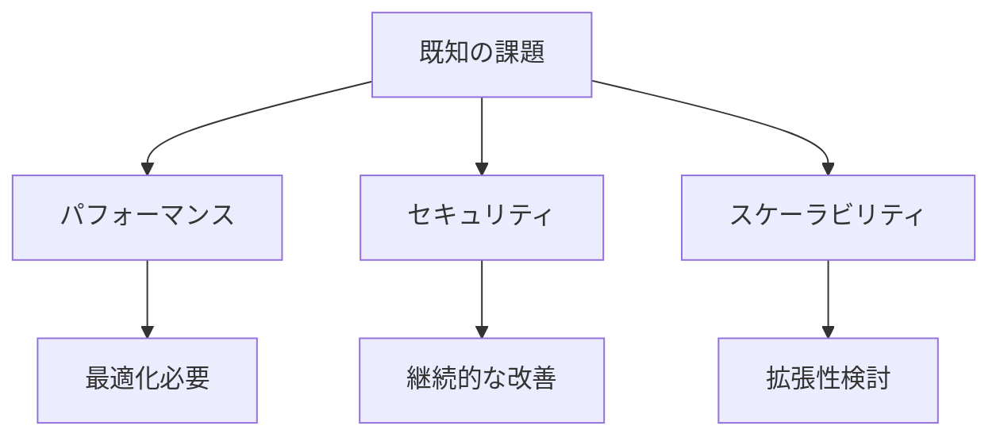

# Progress Tracking: Status & Evolution

## 完了済みの項目

### 1. 初期セットアップ
- [x] リポジトリ構造の確立
- [x] 基本的なドキュメント構造の整備
- [x] メモリーバンクの初期化

### 2. インフラストラクチャ構成
- [x] Ansible Playbookの基本構造
- [x] Terraformモジュールの設計
- [x] Dockerサービスの定義

### 3. ドキュメント整備
- [x] Project Brief作成
- [x] System Patterns定義
- [x] Technical Context確立
- [x] Active Context更新
- [x] Progress追跡開始

## 進行中の作業

### 1. インフラストラクチャ拡張
- [ ] AWS CDKによる追加リソース管理
- [ ] クラウドフロントインフラの最適化
- [ ] コンテナサービスの拡充

### 2. 設定管理の改善
- [ ] 環境固有の設定の整理
- [ ] シークレット管理の強化
- [ ] デプロイメントプロセスの改善

### 3. ドキュメント拡充
- [ ] コンポーネント別の詳細ドキュメント
- [ ] 運用手順書の作成
- [ ] トラブルシューティングガイド

## 今後の課題

### 1. 短期的な課題
1. コンポーネントドキュメントの作成
2. テスト戦略の確立
3. CI/CD パイプラインの強化

### 2. 中期的な課題
1. スケーラビリティの改善
2. モニタリング体制の確立
3. バックアップ戦略の実装

### 3. 長期的な課題
1. コスト最適化
2. パフォーマンスチューニング
3. セキュリティ強化

## プロジェクトの進化

### 1. 主要な決定事項
- インフラのコード化推進
- マイクロサービスアーキテクチャの採用
- セキュリティファーストアプローチ

### 2. 学んだ教訓
- 早期のドキュメント整備の重要性
- モジュール化による再利用性の向上
- 自動化による効率化の実現

### 3. 改善された領域
- コード管理の体系化
- 設定の標準化
- デプロイメントの効率化

## 既知の課題

### 1. 技術的な課題

### 2. 運用上の課題
- 環境間の設定同期
- バックアップ運用
- インシデント対応

### 3. ドキュメント関連
- 更新頻度の維持
- 詳細度の適正化
- ユーザーガイドの充実

## 次のマイルストーン

### Phase 1: 基盤強化
- [ ] コンポーネントドキュメントの完成
- [ ] テスト自動化の実装
- [ ] モニタリングの導入

### Phase 2: 機能拡張
- [ ] 新規サービスの追加
- [ ] バックアップ体制の確立
- [ ] 障害対応プロセスの整備

### Phase 3: 最適化
- [ ] パフォーマンスチューニング
- [ ] コスト最適化
- [ ] セキュリティ強化
