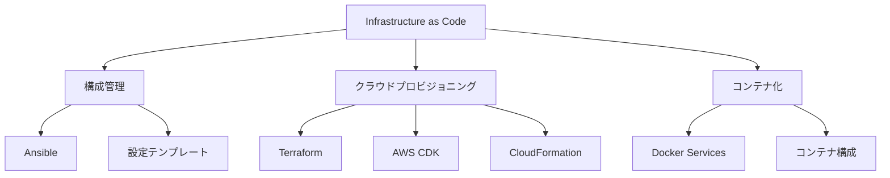
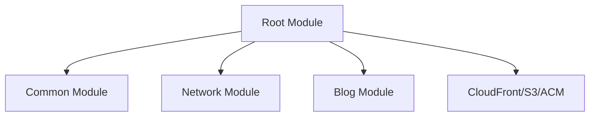
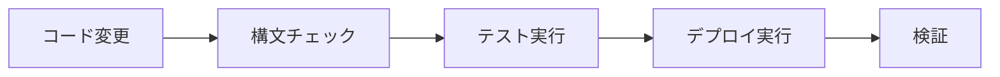
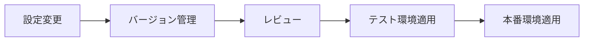

# System Patterns: Architecture & Implementation

## システムアーキテクチャ

## 主要コンポーネント構成

### 1. Ansible構成パターン
- **ロール基準の分割**
  - 共通設定（common）
  - 環境固有設定（dev/prod）
  - サービス固有設定
- **変数管理**
  - group_vars: 環境ごとの変数
  - host_vars: ホスト固有の変数
  - 暗号化された機密情報

### 2. Terraformモジュール構造

### 3. Dockerサービス構成
- **プロキシ設定**
  - リバースプロキシ
  - 内部ネットワーク分離
- **コンテナ化サービス**
  - n8n
  - Named
  - Ansible実行環境
  - Terraform実行環境

## 実装パターン

### 1. 設定管理パターン
- テンプレートベースの設定生成
- 環境変数による構成制御
- 暗号化されたシークレット管理

### 2. デプロイメントパターン
- Infrastructure as Code
- 宣言的構成管理
- 冪等性の保証

### 3. セキュリティパターン
- 最小権限原則
- ネットワークセグメンテーション
- 暗号化による機密情報保護

## 重要な実装経路

1. **環境構築フロー**

2. **設定更新フロー**

## 設計判断基準

1. **モジュール化**
   - 再利用可能なコンポーネント
   - 責務の明確な分離
   - テスト容易性

2. **自動化**
   - 手動操作の最小化
   - エラー検出の自動化
   - 一貫した実行プロセス

3. **セキュリティ**
   - デフォルトで安全な設定
   - アクセス制御の明確化
   - 監査可能性の確保
